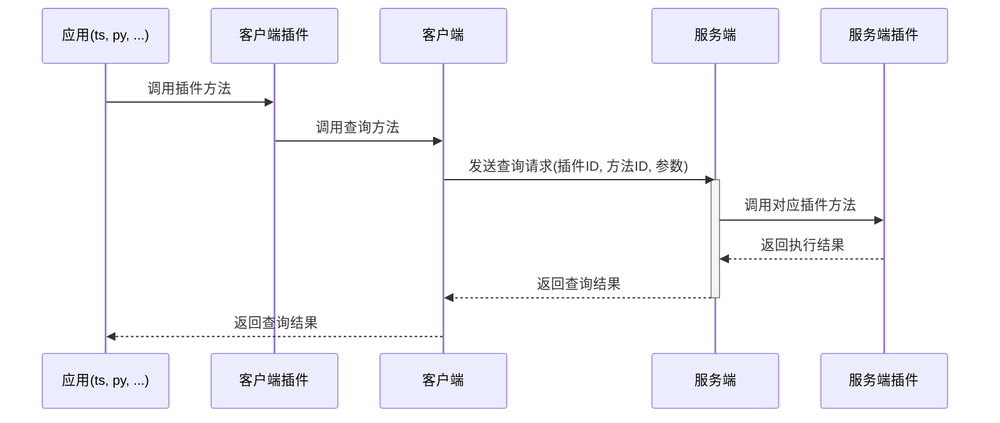
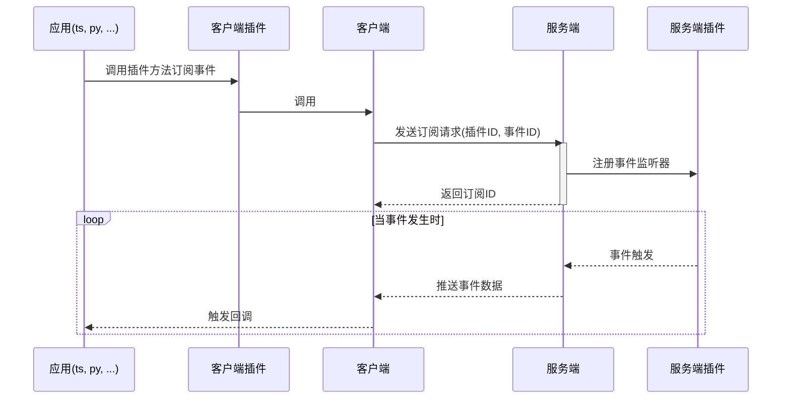

中文 | [English][en]

---

# Resonator

Resonator 是一个基于 WebSocket 的插件化通信框架，支持客户端与服务端之间的查询和事件订阅推送机制。

## 核心功能

### 查询机制

客户端可以向服务端发起查询请求，指定插件和方法，并传递参数：

### 事件订阅与推送

客户端可以订阅服务端事件，当事件发生时服务端会主动推送：

## 许可证

本项目采用 [MIT](./LICENSE) 许可证。

[zh]: README.zh.md
[en]: README.md
